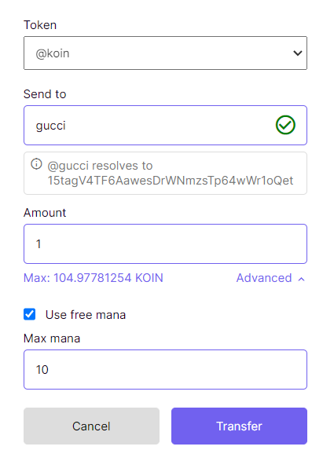

## How to access Koinos Blockchain Network with Node.js

Koinos is made to be accessible to developers and users. With just a few lines of code, we can interact with the blockchain.

[Koinos Community Telegram](https://t.me/koinos_community)

[Koinos Wiki](https://koinos.wiki/)

## Getting Started

[Learn to Use Terminal](https://developer.mozilla.org/en-US/docs/Learn/Tools_and_testing/Understanding_client-side_tools/Command_line)

[Install NPM/Node.js](https://nodejs.org/en/learn/getting-started/how-to-install-nodejs)

[Install Git](https://github.com/git-guides/install-git)

## Clone this repo

```sh
git clone https://github.com/isaacdozier/learn-koinos.git
cd learn-koinos
```

[How to Clone a Repository](https://docs.github.com/en/repositories/creating-and-managing-repositories/cloning-a-repository)

## Install Dependencies

```sh
npm install @koindx/v2-sdk
```

[The Basics of Dependencies for Node.js & NPM](https://nodesource.com/blog/the-basics-of-package-json-in-node-js-and-npm/)

Now open a terminal and run the command below.

## Terminal

```sh
node example_4.js
```

Example #4 outputs USDT/Koin pair data.

## Output

```sh
Pair {
  chain: 'EiBZK_GGVP0H_fXVAM3j6EAuz3-B-l3ejxRSewi7qIBfSA==',
  address: '16PVFQ6bwRnAZD7i3xmu6jX6MoG3vwYYgW',
  provider: Provider {
    rpcNodes: [ 'https://api.koinos.io' ],
    currentNodeId: 0,
    onError: [Function (anonymous)]
  },
  klast: BigNumber { s: 1, e: 25, c: [ 766121720972, 45537572324692 ] },
  block_time: BigNumber { s: 1, e: 12, c: [ 1711789576980 ] },
  token_0: Token {
    chainId: 'EiBZK_GGVP0H_fXVAM3j6EAuz3-B-l3ejxRSewi7qIBfSA==',
    address: '19WrWze3XAoMa3Mwqys4rJMP6emZX2wfpH',
    decimals: undefined,
    symbol: undefined,
    name: undefined,
    isNative: false,
    isToken: true
  },
  token_1: KOIN {
    chainId: 'EiBZK_GGVP0H_fXVAM3j6EAuz3-B-l3ejxRSewi7qIBfSA==',
    address: 'koin',
    decimals: 8,
    symbol: 'KOIN',
    name: 'Koin',
    isNative: true,
    isToken: false
  },
  reserve_0: BigNumber { s: 1, e: 12, c: [ 8638433253253 ] },
  reserve_1: BigNumber { s: 1, e: 12, c: [ 8895397946881 ] },
  total_supply: BigNumber { s: 1, e: 12, c: [ 8544172553644 ] }
}
```


## Run More Examples

Example_6.js : returns Koin & USDT Pool Reserves and estimates the exchange rate by calculating pool impact.

```javascript
const { ChainId, Token, Fetcher, KOIN } = require("@koindx/v2-sdk")
const BigNumber = require("bignumber.js")

// usdt dollar qty in
const udst_dollars_in = 100

// Convert usdt to BigNumber Object
const asset = new BigNumber(udst_dollars_in * 100000000)

// Koindx fee is needed for estimating exchange rate [ 0.25% ]
const koindx_fee = new BigNumber(1 - 0.0025)

go(asset)

async function go(asset_in){
    try{

        // DECLARE ASSETS
        // KOIN can be declared directly with Koindx sdk
        const koin = new KOIN(ChainId.MAINNET)

        // USDT is NOT a native asset and is declared using the Token class
        // This same operation would be used for other alt-tokens in the ecosystem
        const usdt_contract_address = '19WrWze3XAoMa3Mwqys4rJMP6emZX2wfpH'
        const usdt = new Token(ChainId.MAINNET, usdt_contract_address)

        // This retrieves the Koin/USDT pool data by utilizing the Koindx SDK
        const PAIR = await Fetcher.fetchPairData(ChainId.MAINNET, koin, usdt)

        // Lets declare our availible reserves to get the pool ratio
        // This can be used to get an estimated exchange rate for any given pool
        let rsv_0 = PAIR.reserve_0
        let rsv_1 = PAIR.reserve_1

        // Calculate margin impact of asset-in - [ apply koindx fee = 0.25% ]
        let impact = rsv_1.dividedBy(rsv_1.plus(asset_in * koindx_fee))

        // Calculate margin impact of asset-out
        let est = rsv_0.minus(rsv_0.times(impact))

        console.log(est)
        

    } catch (error) {
        console.error(error)
    }
}
```

Find more [Koindx V2-SDK Examples](https://docs.koindx.com/sdk/v2-sdk/examples)


## Working with Numbers

BigNumber.js is an mathmatic standard used for working with a wide range of numbers, strings and object types representing a numeric value.

If you want to create or manipulate them in you app, you'll need to include the dependency below.


```javascript
const BigNumber = require('bignumber.js');
```

This makes working with numbers easier for developers.

[Learn how to work with BigNumber.js](https://mikemcl.github.io/bignumber.js/)


## Arithmic functions with numbers and strings
```javascript
console.log(koin_reserves * 1)
```
```sh
Output: 8810421275766
```

```javascript
console.log(koin_reserves * '1')
```
```sh
Output: 8810421275766
```


## Operation methods

```javascript
let operation = a.plus(b)
                a.minus(b)
                a.dividedBy(b)
                a.times(b)
```

If you liked this guide, check out the step by step process to install a Kondor wallet to interact with the network.


## Support Me

If you are feeling extra generous you can donate to my Koinos wallet directly. Any of the handles below can be used in the Kondor wallet to send assets in-network without fees. Mana is used instead which charges over time. Network costs are an opportunity cost measured with time.

KAP Domain: gucci.koin
Nickname: @gucci
Public Address: 15tagV4TF6AawesDrWNmzsTp64wWr1oQet


